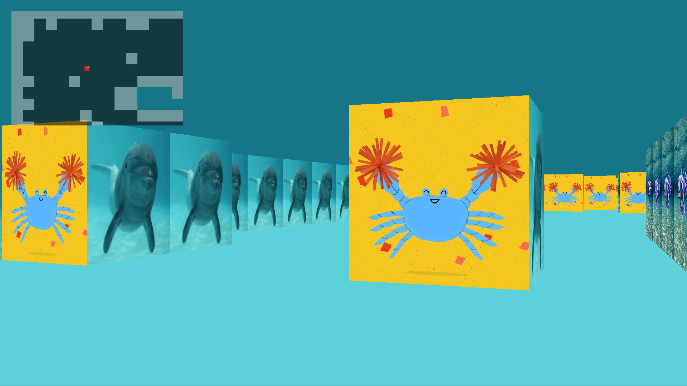

# RayCast3D

RayCast3D is a first-person 3D game where the player navigates through a maze.
The project explores raycasting, graphical rendering, texture mapping and interactive gameplay. It is built in C.



## Features

- **Raycasting**: Implement a raycasting engine to render a 3D perspective from a 2D map.
- **Texture Mapping**: Apply textures to walls for a realistic look.
- **Player Movement**: Enable the player to move and look around the game world.
- **Minimap**: Display a minimap to help the player navigate the maze.
- **Interactive elements**: Player can interact with the environment.


## Controls

  - W, A, S, D: Move forward, left, backward, and right
  - Arrow keys: Turn left and right
  - M: Toggle the view of the minimap
  - +, -: Zoom in and out on the minimap
  - Space: Open doors

## Installation

1. Clone the repository:
  ```sh
  git clone https://github.com/DorukEmre/RayCast3D.git
  cd RayCast3D
  ```

2. Make sure you have the required libraries installed. If you're using Homebrew, you can install GLFW with:
  ```sh
  brew install glfw
  ```

3. Build the project:
  ```sh
  make
  ```

## Usage

After building the project, you can execute the program using:
  ```sh
  ./RayCast3D maps/ocean.cub
  ./RayCast3D maps/door.cub
  ```

## Project Structure

    src/: Contains the source code files.
    inc/: Contains the header files.
    lib/: Contains the libraries (MLX42 and libft).
    maps/: Contains example map files.

## Makefile Targets

    all: Builds the project and required libraries.
    libmlx: Builds the MLX42 library.
    libft: Builds the libft library.
    clean: Removes object files and build directory.
    fclean: Cleans up all build files and the executable.
    re: Cleans and rebuilds the project.


## Acknowledgements

    MLX42: A modern version of the MiniLibX library for graphics.
    Developed with @BenjaminLarger


## Demo

[](RayCast3D_720p.mp4)